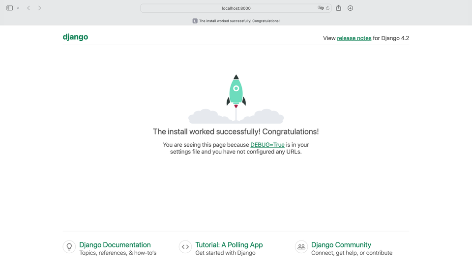
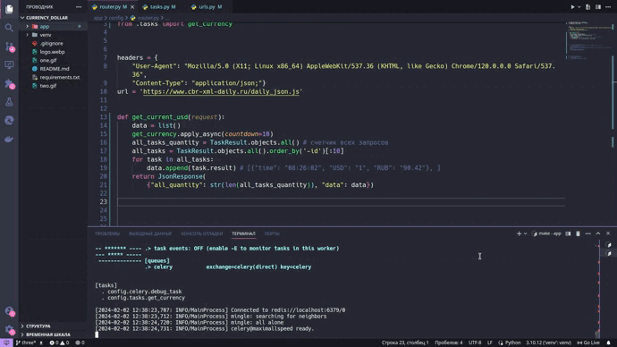
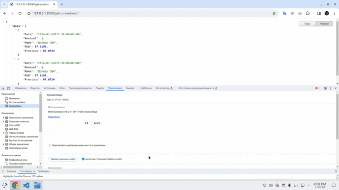
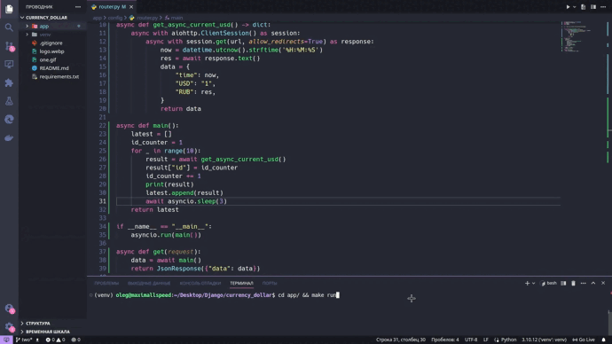

### Тестовое задание 

Нажмите, чтобы посмотреть подробности

Предлагаем вам создать "голый" джанго проект, который по переходу на страницу /get-current-usd/ бужет отображать в json формате актуальный курс доллара к рублю (запрос по апи, найти самостоятельно) и показывать 10 последних запросов (паузу между запросами курсов должна быть не менее 10 секунд)

## Установка
### 0) Запустить redis | выполнить команду в терминале (Linux)
    redis-server 

### 1) Создать виртуальное окружение 

### 2) Установить зависимости

    pip install -r requirements.txt

### 3) Из директории (app), где расположен файл manage.py, выполните команду

    make migrate && make run  

### 4) В новом окне терминала запустить celery
    make celery

### 5) Перейти по адресу
    http://127.0.0.1:8000/get-current-usd/

## Пример для branch three

## Пример для branch one

## Пример для branch two
